# Local data flow

```mermaid
flowchart LR
  Docs[TXT / PDF / DOCX bytes] --> Import[Bounded importer / killable worker]
  Import --> Proposed[Proposed facts + source spans]
  Proposed --> ProfileReview[Authenticated local profile review]
  ProfileReview --> ProfileDB[DPAPI profile revisions / SQLite]
  Job[Reviewed synthetic job] --> Rules[Deterministic requirements and answers]
  ProfileDB --> Rules
  Memory[Reviewed scoped answer memory] --> Rules
  Rules --> Draft[Fixed synthetic package + hashes]

  Draft --> ShareUI[Authenticated UI sharing approval]
  ShareUI --> Browser[Managed Chromium fills fixed loopback form]
  Browser --> SubmitUI[Authenticated UI submission approval]
  SubmitUI --> StoredApproval[10-minute payload-bound approval]
  StoredApproval --> Claim[Atomic durable submission claim]
  Claim --> Site[One validated POST to synthetic site]
  Site --> Evidence[Verified receipt or explicit uncertainty]
  Evidence --> Journal[Synthetic application journal]

  ProfileDB --> ReadTools[3 read-only STDIO MCP tools]
  Journal --> ReadTools
  Commands[3 opt-in fixed-synthetic MCP commands] --> Bridge[DPAPI loopback registration / 8-hour token]
  Bridge --> Coordinator[Companion coordinator]
  Coordinator --> Draft
  Coordinator --> ReviewFlag[Local UI review request]
  Coordinator --> Claim
  SubmitUI -. approval never comes from MCP .-> Coordinator
```

The importer accepts streams rather than source paths. Original bytes are bounded and hashed. PDF/DOCX CPU parsing runs in a child process that can be killed on cancellation, timeout or protocol-output limits. Extracted facts remain proposed until the local user confirms them. Scan-only PDF pages yield `NeedsOcr`; active DOCX content and external relationships are rejected.

Before sharing consent, the managed browser does not contact the synthetic career site. During preparation, only approved-origin GET requests are forwarded. File bytes and answer values are compared with the approved package before the one submission POST can be sent. Browser redirects and transport retries are disabled. A verified receipt must match the application, file hash, echoed answers and package hash. Missing or invalid evidence remains uncertain.

The default MCP process exposes only `runtime_get_capabilities`, `profile_get_summary` and `application_get_status`. When both companion and MCP start with `JOBAGENT_ENABLE_SYNTHETIC_COMMANDS=1`, the MCP also exposes `application_create_draft`, `application_prepare_review` and `application_execute_approved`. The commands accept no profile data, file, URL, path, answer, session or approval value.

The companion owns the browser and coordinator. It publishes a current-user DPAPI-protected registration containing a separate loopback bearer and an eight-hour expiry. The MCP bridge client uses that registration without proxy, cookies, redirects or retry. The bridge returns only application reference, status, review-requested, submission-approved and verified receipt ID.

Creating a draft or requesting review does not authorize sharing or submission. The authenticated browser UI performs those actions separately. Submission approval is valid for ten minutes and is consumed by the journal claim. A CAPTCHA/MFA detected before claim clears that approval and pauses. After claim, any ambiguous result stays `SubmittedUnverified`. If the bridge reports `CommandOutcomeUnknownCheckStatus`, the caller polls `application_get_status`; it does not repeat execution.

This flow is restricted to the bundled synthetic profile, job, CV and local career site. It does not connect to a remote model provider during deterministic tests, does not implement the master plan's general 12-tool service, and does not authorize live employers or LinkedIn.
