# Local data flow

```mermaid
flowchart LR
  CV[Embedded synthetic TXT] --> Import[Bounded text import]
  Import --> Review[Local profile confirmation]
  Review --> DB[DPAPI profile revisions / SQLite]
  DB --> Rules[Job evaluation and answer rules]
  Rules --> Draft[Application package + hashes]
  Draft --> Share[Authenticated UI sharing approval]
  Share --> Browser[Managed Chromium]
  Browser --> Final[Authenticated UI final approval]
  Final --> Claim[Atomic durable submission claim]
  Claim --> Site[One validated POST to synthetic site]
  Site --> Evidence[Receipt or explicit uncertainty]
  Evidence --> Journal[Synthetic application journal]
  DB --> MCP[Read-only STDIO MCP summaries]
  Journal --> MCP
```

Before sharing consent the managed browser does not contact the site. During
preparation only approved-origin GET requests are forwarded. File bytes and
answer values are compared with the approved package before the one submission
POST can be forwarded. Redirects and transport retries are disabled. A receipt
must match application, file hash and echoed answer values; evidence records the
approved package hash. A missing or invalid receipt means uncertainty.

The page scripts, imported text and tool arguments are untrusted inputs. Approval
creation exists only at the authenticated UI boundary. MCP can return version,
verified skill names and application status; it cannot approve, navigate or send.
Current model mode is Fixture; no remote language-model provider is connected.
